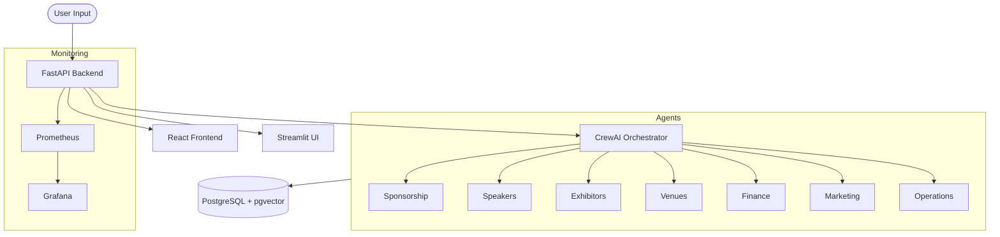

# Event Agent: AI-Driven Conference Orchestrator 🚀

An autonomous, multi-agent event planning system built on **CrewAI**, **FastAPI**, and **React**. It transforms high-level event concepts into detailed, data-driven execution plans using a squad of 7 specialized AI agents.

## 🌟 Overview

The Event Agent project is a production-ready demonstration of agentic workflows. By decomposing the complex task of event planning into specialized roles, the system ensures precision in sponsorship, speaker relations, venue operations, and financial modeling.

---

## 🤖 The 7-Agent Squad

The system leverages **Gemini 2.0 Flash** (via OpenRouter) to power seven distinct agents, each orchestrating a specific domain of the event lifecycle:

| Agent | Responsibility | Key Tool/Metric |
| :--- | :--- | :--- |
| **Sponsorship VP** | Identify & score potential corporate sponsors. | Sponsor Relevance Scoring |
| **Speaker Relations** | Recruit speakers and verify influence via LinkedIn. | Speaker Influence Scorer |
| **Exhibition Director** | Cluster and target vendors from competitor events. | Dynamic Clustering Engine |
| **Ops Lead (Venue)** | Filter and secure venues by budget & footfall. | Venue Viability Engine |
| **Revenue/Finance** | simulate pricing models to maximize yield. | Predictive Pricing Model |
| **Community CMO** | Growth-hacking & community outreach (Discord/Slack). | GTM Distribution Logic |
| **Logistics Lead** | Build conflict-free schedules and room allocation. | Conflict Detection System |

---

## 🏗 System Architecture



---

## 🛠 Tech Stack

- **Core Framework**: [CrewAI](https://crewai.com) for agent orchestration.
- **LLM**: Google Gemini 2.0 Flash (via [OpenRouter](https://openrouter.ai)).
- **Backend API**: [FastAPI](https://fastapi.tiangolo.com).
- **Frontend**: [React](https://reactjs.org) (Modern UI) & [Streamlit](https://streamlit.io) (Data Prototyping).
- **Database**: PostgreSQL with `pgvector` for memory and state persistence.
- **Observability**: Prometheus & Grafana.
- **Package Manager**: [uv](https://github.com/astral-sh/uv).
- **Infra**: Docker & Docker Compose.

---

## 🚀 Getting Started

### Prerequisites

- Python 3.12+ (managed by `uv` recommended)
- Docker & Docker Compose
- API Keys: `OPENROUTER_API_KEY`, `SERPER_API_KEY`

### Local Development

1.  **Clone and Install**:
    ```bash
    git clone <repo-url>
    cd eventagnet0.1
    uv sync
    ```

2.  **Environment Setup**:
    Copy `.env.example` to `.env` and fill in your keys.

3.  **Run Backend**:
    ```bash
    uvicorn src.main:app --reload
    ```

4.  **Run Frontend (React)**:
    ```bash
    cd frontend
    npm install
    npm run dev
    ```

### Docker Deployment

For a full production-like environment (DB, API, Frontend, Monitoring):

```bash
docker compose up --build
```

- **API**: http://localhost:8000
- **React Frontend**: http://localhost:5173
- **Streamlit**: http://localhost:8501
- **Grafana**: http://localhost:3000 (Admin/Admin)

---

## 📈 Monitoring & Observability

The system includes a full observability stack:
- **FastAPI Metrics**: Instrumented with `starlette-prometheus`.
- **Agent Tracing**: Integrated with **Langfuse** for reasoning transparency.
- **Dashboards**: Pre-configured Grafana dashboards for system health.

---

## 📄 License

This project is licensed under the MIT License - see the [LICENSE](LICENSE) file for details.
